# Programming Engine — System Update (22 March 2026)

## What we have built

An end-to-end **automated programming system** for Lockeroom that:

1. **Ingests** every member's training history from TeamBuilder (via Supabase).
2. **Normalises** that history into a structured format (sessions, series, exercises).
3. **Detects** what training phase each member is in (rep-range progression).
4. **Generates** a new program respecting 16 coaching rules, exercise exclusions, and the member's selected progression scheme.
5. **Writes** the generated program to Supabase for review.
6. **Provides a coach-facing editor** (React app) where coaches can review, swap exercises, tweak sets/reps, change scheme, and regenerate on the fly.
7. **Syncs back from TeamBuilder** via a Playwright browser scraper that treats TeamBuilder as the source of truth — overwriting `programming_generated` to stay aligned with what the coaches actually programmed.

---

## What we haven't built yet

These items are **not yet automated in production** (CEO view). They are the main gaps after everything in **What we have built**.

| Priority | Item | What it is | Why it matters |
|----------|------|------------|----------------|
| **1** | **Weekly automation for TeamBuildr → Supabase (browser scraping)** | Today the Playwright batch (`npm run batch` in `teambuilder-sync/`) is run **manually** on a machine with Chrome/Chromium. There is **no** GitHub Actions or server cron for it yet. | The weekly **program generator** reads from `programming_generated` when present. If we don’t pull TeamBuildr into Supabase **before** that run, the next generated block can be based on **stale** programs (coaches may have changed the live calendar after our last sync). |
| **2** | **Supabase → TeamBuildr upload script (Playwright)** | A second script (not built yet) would push **finalized** programs from our database into TeamBuildr, replacing manual admin entry. Rules: only write calendar days **from today onward** (see `docs/admin-upload-instructions-for-ai.md` §6.1). Would tie to existing **Finalize** / **Mark uploaded** workflow in the coach app. | Cuts admin time and reduces copy-paste errors between our editor and TeamBuildr. |

### When to run the browser sync vs weekly generation

- **Weekly program generation (already live):** GitHub runs every **Monday 7:00pm AEST** (normalize → auto-exclusions → generate for due members). **Not** Sunday. *(Engineering note: GitHub cron is `09:00 UTC` Monday. **AEST = UTC+10** → 7:00pm. During **AEDT** (daylight saving, UTC+11) the same run is **8:00pm** local.)*
- **Goal:** Run the **TeamBuildr → Supabase** scrape **after** coaches usually finish editing TeamBuildr for the week, but **before** **Monday 7:00pm AEST**.

| Option | Idea | Trade-off |
|--------|------|-----------|
| **A (tightest fit)** | **Sunday evening (AEST)** or **Monday before 7:00pm AEST** | Best match to Monday generation; weekend TB changes are captured. |
| **B (earlier in the week)** | e.g. **Friday** | Simpler operationally, but coach changes **Saturday through Monday before 7:00pm AEST** would **not** be in Supabase before the Monday generator — use only if weekend TB edits are rare. |

**Recommendation:** Prefer **Sunday evening (AEST)** or **Monday 4:00–6:00pm AEST**, then wire **automated** Playwright on that schedule as **step 0** before the existing **Monday 7:00pm AEST** job (or a combined pipeline).

---

## System components

| Component | Tech | Location |
|-----------|------|----------|
| Normalisation + generation pipeline | Python | `tools/` |
| Regeneration API | FastAPI on Railway | `api/` |
| Coach program editor | React + Vite + Tailwind | `frontend/` |
| Exercise library sync | Node.js | `exercise-library-sheet-sync/` |
| TeamBuilder scraper + batch sync | TypeScript + Playwright | `teambuilder-sync/` |
| Database | Supabase (10 tables) | See ONE-PAGE-PLAN.md |
| Admin dashboards | Retool | `retool/` |
| Batch generation | Python + GitHub Actions | `tools/run_weekly_batch.py` |

---

## Step-by-step system flow

### Phase 1 — Program generation

1. **Member setup** — Admin assigns a member in `member_programs` with a coach, gym, scheme (GPP / Hypertrophy / Strength), and sessions per week.
2. **Ingest** — `normalize_one_member.py` reads `member_tbresults` + `exercise_library` from Supabase and produces a normalised past program (sessions, series labels A1/A2/B1/etc, exercises with sets and reps).
3. **Phase detection** — `detect_phase.py` examines the A-series (compound lifts) median reps from the normalised program. Compares against the member's selected progression scheme to determine current rep range and next rep range (e.g. GPP: 10-12 → 8-10 → 6-8 → 4-6 → cycle).
4. **Load config** — `load_rules.py` loads the 16 active coaching rules, the progression scheme steps, and any per-member exercise exclusions.
5. **Generate** — `generate_program.py` builds a new program:
   - Carries forward exercises from the previous program (compounds stay, accessories persist within scheme).
   - Updates rep ranges: A/B series at the scheme's target range, C/D accessories at +2 reps.
   - Enforces rules (superset press/pull pairing, C-series self-sufficiency, warm-up structure, session timing, etc).
   - Applies exercise exclusions. Never invents exercises — only selects from `exercise_library`.
6. **Write** — `write_programs.py` inserts the generated program into `programming_generated` with metadata: `duration_weeks`, `phase_number`, `scheme_name`, `rep_range`, `changes_summary`, `rules_applied`. The `uploaded_to_teambuildr` column defaults to `false`.

### Phase 2 — Admin review and upload

7. **Coach review** — Coaches open the **Program Editor** frontend. They can:
   - View the generated program day-by-day, grouped by series (WU → A → B → C/D → CD).
   - Swap exercises (searched from `exercise_library`), edit sets/reps/notes, change series labels, add or delete exercises.
   - All edits are stored as differential records in `programming_coach_edits` (original payload is never mutated).
   - Change scheme, rep range, or sessions/week and hit "Regenerate Workout" — calls the Railway API which re-runs the full pipeline.
8. **Upload to TeamBuilder** — Admin manually uploads the approved program into TeamBuilder and sets `uploaded_to_teambuildr = true` on the `programming_generated` row.
   - **Future:** A planned **Supabase → TeamBuildr Playwright** script (see *What we haven’t built yet*) can **remove this manual step** by pushing the finalized payload into TeamBuildr and setting `uploaded_to_teambuildr = true` after a verified upload (calendar rule: only **today onward**).

### Phase 3 — TeamBuilder sync (keeping Supabase aligned)

**How Playwright does it (no server “webhook”):** The script launches Chromium, logs into TeamBuildr, searches each athlete, opens their calendar, and **reads the DOM** (exercise names/order for each day). It does **not** call a TeamBuildr API. Results are written to Supabase with the service role key (`replaceAllSessions` on `programming_generated`).

**Trigger today:** There is **no** GitHub Action or cron in this repo for `teambuilder-sync`. You run it manually (`npm run batch` in `teambuilder-sync/`) or schedule it yourself (e.g. Windows Task Scheduler, or a future CI job that installs Node + Playwright). **Weekly automation in GitHub** is only the **Python** pipeline (see step 13 below): `normalize_one_member.py` → `apply_auto_exclusions.py` → `run_weekly_batch.py` — **not** the Playwright batch.

**Why this sync exists:** TeamBuildr is where coaches often **change** the live program (swaps, order, days). The generator’s **next** program is built from the **latest `programming_generated` payload** when one exists (`fetch_latest_generated_program` in `tools/generate_program.py`). If you never pulled TeamBuildr back into Supabase, `programming_generated` could drift from what the member actually has; the next auto-generated block would then carry forward the **wrong** “previous program.” The Playwright sync **re-aligns** `programming_generated` with TeamBuildr so the next generation cycle starts from **reality**.

**Quirk — two data sources for generation:** `run_pipeline.py` / `run_weekly_batch.py` use **`programming_generated` sessions** as the **program template** input when a row exists. **Phase detection** (current/next rep range) still prefers **`member_tbresults`** (logged sets/reps from TeamBuildr sync into Supabase) so progression reflects what they **actually lifted**, not only what was prescribed on the sheet.

9. **Batch sync** — `batch-sync.ts` runs with a single Playwright browser session:
   - Queries `member_programs` for all members (468 in current dataset).
   - For each member, looks up the active `programming_generated` row whose date window covers the target week.
   - **Guard**: skips members where `uploaded_to_teambuildr = false` (program not yet approved by admin).
   - **Guard**: skips members with no `programming_generated` row at all.
   - Logs into TeamBuilder once, then for each member: navigates to their calendar, scrapes Monday through Friday.
   - Filters out non-exercise items (section headers, physicals assessments, health tracking, body weight, step count).
   - Builds new session payloads from the scraped data and overwrites the `programming_generated` payload and `sessions_per_week`.
   - Sets `coach_edited: true` and `updated_at` on the row.
   - Logs every member's result (success / failed / skipped) to `programming_sync_log` with a shared `run_id`.
   - Progress is saved to `batch-progress.json` after each member — if the process crashes, it resumes from where it stopped.

### Phase 4 — Feedback loop (self-improving)

10. **Coach feedback** — Coaches submit feedback via Retool (exercise_swap, pairing_issue, too_hard, too_easy, positive, other).
11. **Auto-exclusion** — `apply_auto_exclusions.py` reads feedback; if an exercise has 3+ negative flags for a member, it automatically creates an exclusion in `programming_exercise_exclusions`.
12. **Rule-hit tracking** — Each generated program records which rules fired in `rules_applied` JSONB; correlated with feedback to identify rules that produce poor outcomes.

### Weekly cycle (steady state)

13. **Weekly batch generation** — `run_weekly_batch.py` runs **Monday 7:00pm AEST** (GitHub Actions cron `09:00 UTC` Monday). Finds members whose programs are due within 8 days or awaiting a program. Skips members with a recent generation. Runs the full pipeline for each.
14. **Admin review → upload → sync** cycle repeats.

---

## First batch sync results (20 March 2026)

| Outcome | Count |
|---------|-------|
| Success | 367 |
| Failed | 13 |
| Skipped | 88 |
| **Total** | **468** |
| Runtime | 126.7 minutes |

**Failed breakdown:**
- 7 × Supabase write failed (likely `sessions_per_week` constraint violations for members with 1 or 6+ days)
- 6 × Not found in TeamBuilder (name mismatch between Supabase and TeamBuilder)

**Skipped:** 88 members with no `programming_generated` row (program not yet generated).

---

## Architecture diagram

```mermaid
flowchart LR
    subgraph Sources["Data Sources"]
        TB_HIST["TeamBuilder<br/>(member_tbresults)"]
        EX_LIB["exercise_library"]
        MP["member_programs<br/>(scheme, coach, gym)"]
    end

    subgraph Pipeline["Generation Pipeline (Python)"]
        NORM["Normalize<br/>normalize_one_member.py"]
        PHASE["Phase Detect<br/>detect_phase.py"]
        RULES["Load Config<br/>load_rules.py<br/>(16 rules + exclusions)"]
        GEN["Generate Program<br/>generate_program.py"]
        WRITE["Write<br/>write_programs.py"]
    end

    subgraph Storage["Supabase"]
        NP["programming_<br/>normalized_programs"]
        PG["programming_<br/>generated<br/>(uploaded = false)"]
        PG_LIVE["programming_<br/>generated<br/>(uploaded = true)"]
        EDITS["programming_<br/>coach_edits"]
        FEEDBACK["programming_<br/>feedback"]
        EXCL["programming_<br/>exercise_exclusions"]
        SYNC_LOG["programming_<br/>sync_log"]
    end

    subgraph Admin["Admin Review"]
        EDITOR["Program Editor<br/>(React frontend)"]
        REGEN["Regeneration API<br/>(FastAPI / Railway)"]
        UPLOAD["Manual upload<br/>to TeamBuilder"]
    end

    subgraph Scraper["TeamBuilder Sync (Playwright)"]
        TB_LIVE["TeamBuilder<br/>(live programs)"]
        BATCH["batch-sync.ts"]
        direction TB
        CHK_UPLOAD{"uploaded_to<br/>teambuildr?"}
        CHK_PROG{"Has generated<br/>program?"}
        CHK_FOUND{"Found in<br/>TeamBuilder?"}
        CHK_WRITE{"Supabase<br/>write OK?"}
        SKIP_NP["SKIP:<br/>no program"]
        SKIP_NU["SKIP:<br/>not uploaded"]
        FAIL_NF["FAIL:<br/>not found"]
        FAIL_WR["FAIL:<br/>write error"]
    end

    subgraph Future["Estimated Future"]
        AUTO_EXCL["Auto-exclusion<br/>(3+ negative → exclude)"]
        RULE_TUNE["Rule-hit analysis<br/>(rule × feedback)"]
        WEEKLY["Weekly batch<br/>generation<br/>(GitHub Actions)"]
    end

    %% Generation flow
    TB_HIST --> NORM
    EX_LIB --> NORM
    MP --> NORM
    NORM --> NP
    NORM --> PHASE
    PHASE --> GEN
    RULES --> GEN
    EX_LIB --> GEN
    GEN --> WRITE
    WRITE --> PG

    %% Admin review
    PG --> EDITOR
    EDITOR --> EDITS
    EDITOR -->|"scheme/rep/sessions<br/>change"| REGEN
    REGEN -->|"re-run pipeline"| PG
    EDITOR --> UPLOAD
    UPLOAD -->|"set uploaded = true"| PG_LIVE

    %% Scraper flow with validation branches
    PG_LIVE --> BATCH
    TB_LIVE --> BATCH
    BATCH --> CHK_PROG
    CHK_PROG -->|No| SKIP_NP
    CHK_PROG -->|Yes| CHK_UPLOAD
    CHK_UPLOAD -->|No| SKIP_NU
    CHK_UPLOAD -->|Yes| CHK_FOUND
    CHK_FOUND -->|No| FAIL_NF
    CHK_FOUND -->|Yes| CHK_WRITE
    CHK_WRITE -->|No| FAIL_WR
    CHK_WRITE -->|Yes| PG_LIVE
    SKIP_NP --> SYNC_LOG
    SKIP_NU --> SYNC_LOG
    FAIL_NF --> SYNC_LOG
    FAIL_WR --> SYNC_LOG
    CHK_WRITE --> SYNC_LOG

    %% Feedback loop
    EDITOR --> FEEDBACK
    FEEDBACK --> AUTO_EXCL
    AUTO_EXCL --> EXCL
    EXCL --> GEN
    FEEDBACK --> RULE_TUNE

    %% Weekly cycle
    MP --> WEEKLY
    WEEKLY -->|"runs full pipeline"| PG

    %% Styling
    classDef skip fill:#f0f0f0,stroke:#999,color:#666
    classDef fail fill:#fee,stroke:#c33,color:#900
    classDef future fill:#f0f7ff,stroke:#69c,color:#369,stroke-dasharray: 5 5
    class SKIP_NP,SKIP_NU skip
    class FAIL_NF,FAIL_WR fail
    class AUTO_EXCL,RULE_TUNE,WEEKLY future
```

---

## Key design decisions

| Decision | Rationale |
|----------|-----------|
| TeamBuilder is source of truth for exercise selection | Coaches make real-time changes in TeamBuilder; our system must stay aligned rather than fight upstream edits |
| `uploaded_to_teambuildr` guard on sync | Prevents the scraper from overwriting a just-generated program that hasn't been approved yet |
| Differential edits (`programming_coach_edits`) | Original generated payload stays intact; edits are layered on top, enabling "what changed?" analytics |
| Per-row `uploaded_to_teambuildr` flag (not auto-reset) | New generated programs get `false` by default; old programs keep `true`. Scraper naturally targets the active uploaded program |
| `programming_sync_log` audit table | Permanent record of every batch run — who was synced, who failed, why — queryable by `run_id` |
| Resume via `batch-progress.json` | 468 members at ~20s each = ~2.5 hours. Must survive crashes without restarting |
| Scraper filters (skipPatterns) | TeamBuilder calendar contains non-exercise items (section headers, physicals, health tracking). Regex filters ensure only real exercises are synced |

---

## How to run each component

| Task | Command | Location |
|------|---------|----------|
| Generate for one member | `python tools/run_pipeline.py <member_id> --scheme GPP --sessions-per-week 3` | repo root |
| Weekly batch generation | `python tools/run_weekly_batch.py` (or GitHub Actions **Monday 7:00pm AEST**, cron `09:00 UTC`) | repo root |
| Start program editor | `cd frontend && npm run dev` | `frontend/` |
| Regeneration API (local) | `python -m uvicorn api.main:app --port 8001` | repo root |
| Sync one member from TeamBuilder | `npm run sync -- --member="Last, First" --date=2026-03-23 --sync-week` | `teambuilder-sync/` |
| Batch sync all members | `npm run batch` | `teambuilder-sync/` |
| Batch sync (dry run) | `npm run batch:dry` | `teambuilder-sync/` |
| Batch sync (reset + restart) | `npm run batch -- --reset` | `teambuilder-sync/` |
| Check batch sync results | `SELECT status, count(*) FROM programming_sync_log WHERE run_id = '<id>' GROUP BY status;` | Supabase SQL |
| Apply auto-exclusions | `python tools/apply_auto_exclusions.py` | repo root |

---

## Supabase tables (10)

| # | Table | Purpose |
|---|-------|---------|
| 1 | `programming_progression_schemes` | Rep-range ladders per scheme (GPP, Hypertrophy, Strength) |
| 2 | `programming_exercise_exclusions` | Per-member banned exercises |
| 3 | `programming_removal_requests` | Coach requests to remove exercises from the library |
| 4 | `programming_rules` | 16 coaching rules (composition, pairing, timing, volume, etc) |
| 5 | `programming_normalized_programs` | Normalised past programs from TeamBuilder history |
| 6 | `programming_generated` | Generated programs (the main output table) |
| 7 | `programming_feedback` | Coach feedback on generated programs |
| 8 | `programming_coach_edits` | Differential edits layered on generated programs |
| 9 | `programming_regeneration_requests` | Queue for regeneration when config changes |
| 10 | `programming_sync_log` | Audit trail for TeamBuilder batch sync runs |

---

## What's next

- **Planned: Supabase → TeamBuildr upload (Playwright)** — New script in `teambuilder-sync/` (not built yet). Trigger: coach **Finalize** (`coach_approved`) then admin flow or API; reuses login/navigation patterns from the pull sync. **Calendar rule (upload only):** when pushing into TeamBuildr, **do not** overwrite or create workouts on calendar dates **before** “today” (agreed gym timezone); only **today and future** days get payload updates. This rule does **not** apply to the existing TeamBuildr → Supabase scraper. See `docs/admin-upload-instructions-for-ai.md` §6.1.
- **Investigate the 13 failed members** from the first batch sync (7 write failures likely need `sessions_per_week` constraint expansion; 6 name mismatches need manual mapping).
- **Trial weekly cycle**: Generate → Review → Upload → Sync → Feedback.
- **Wire auto-exclusion** to run on schedule (feedback → exclusions).
- **Rule-hit analysis**: correlate `rules_applied` with feedback to surface rules that consistently produce poor results.
- **Coach edit analytics**: track which exercises get swapped most, which coaches make the most edits, whether edits decrease over time as the generator improves.
