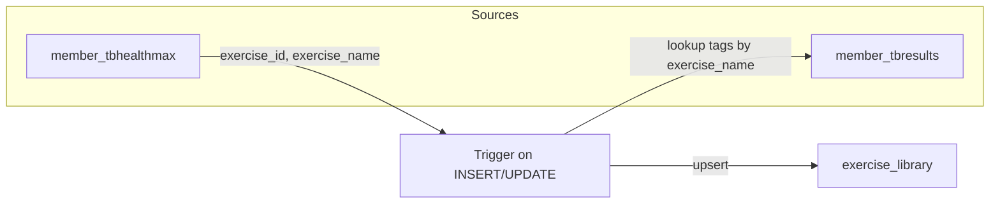

# exercise_library_function

```mermaid
flowchart LR
  subgraph sources [Sources]
    TBHealthmax[member_tbhealthmax]
    TBResults[member_tbresults]
  end
  Trigger[Trigger on INSERT/UPDATE]
  Library[exercise_library]
  TBHealthmax -->|"exercise_id, exercise_name"| Trigger
  Trigger -->|"lookup tags by exercise_name"| TBResults
  Trigger -->|"upsert"| Library
```
